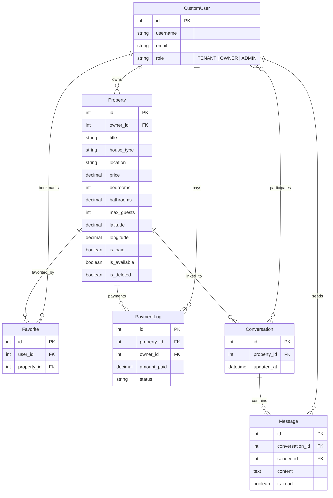

# 🏠 Mela Rent – House Rental Platform API

[](https://www.python.org/)
[](https://www.djangoproject.com/)
[](https://www.django-rest-framework.org/)
[](https://www.postgresql.org/)
[](LICENSE)

**Mela Rent** is a production-grade REST API for a house rental marketplace — connecting property owners with potential tenants. Built with Django REST Framework and inspired by platforms like **Airbnb**, it features JWT authentication, role-based access control, advanced property search, a wishlist system, mock payment gating, direct messaging, and geolocation support.

**Developer:** Tesfahun Kassahun

---

## 📑 Table of Contents

- [Features](#-features)
- [Tech Stack](#-tech-stack)
- [Architecture](#-architecture)
- [Getting Started](#-getting-started)
- [API Endpoints](#-api-endpoints)
- [Search, Filtering & Sorting](#-search-filtering--sorting)
- [Database Schema](#-database-schema)
- [Testing](#-testing)
- [Security](#-security)
- [Project Structure](#-project-structure)
- [Documentation](#-documentation)

---

## ✨ Features

### Authentication & Users
- Custom user model with **role-based access** (TENANT, OWNER, ADMIN)
- **JWT authentication** (access + refresh tokens) via SimpleJWT
- **Frictionless onboarding** — all users register as TENANT by default
- **Progressive role upgrade** — automatically promoted to OWNER on first property creation

### Property Management
- Full **CRUD** operations with owner-only write permissions
- **Soft deletion** — preserves data integrity and relational history
- **Geolocation** — latitude/longitude fields for map integration
- **Image upload** support
- **Payment gating** — listings require mock payment before public visibility
- Environment-driven business rules (`PROPERTY_LISTING_PRICE`, `LISTING_EXPIRATION_DAYS`)

### Search & Discovery
- **Keyword search** across title, description, and location
- **Advanced filtering** — price range, bedrooms, bathrooms, guests, house type, location, amenities, availability
- **Dynamic sorting** — by price or creation date (ascending/descending)
- Powered by `django-filter`, `SearchFilter`, and `OrderingFilter`

### Wishlist / Favorites
- Tenants can bookmark properties for later
- Owners can favorite other owners' listings (but not their own)
- **Duplicate prevention** at serializer level
- **Nested serialization** — favorites list includes full property details

### Direct Messaging
- **Inbox-Thread-Message** pattern (Airbnb-style)
- Start conversations linked to specific properties
- **Unread count** and **last message preview** for inbox UI
- **Mark-as-read** functionality
- **Participant-only access** — 5-layer security model
- Anti-spam: duplicate conversation and self-messaging prevention

### Payments
- Mock payment endpoint for listing activation
- `PaymentLog` model for transaction history
- Automatic `is_paid` toggling and `paid_until` calculation

---

## 🛠 Tech Stack

| Layer | Technology |
|-------|-----------|
| **Language** | Python 3.13 |
| **Framework** | Django 5.2 + Django REST Framework 3.15 |
| **Database** | PostgreSQL 15 (Dockerized) |
| **Authentication** | JWT via `djangorestframework-simplejwt` |
| **Filtering** | `django-filter` |
| **Image Handling** | Pillow |
| **Containerization** | Docker Compose |

---

## 🏗 Architecture

```
┌──────────────────────────────────────────────────────────┐
│                    Mela Rent Backend                      │
│                                                          │
│  ┌──────────┐  ┌────────────┐  ┌──────────────┐         │
│  │  users   │  │ properties │  │ interactions  │         │
│  │ Auth/JWT │  │ CRUD/Geo   │  │ Favs/Payments │         │
│  └────┬─────┘  └─────┬──────┘  └──────────────┘         │
│       │              │                                   │
│       │    ┌─────────┴───────────┐                       │
│       └────┤     messaging       │                       │
│            │ Conversations/Msgs  │                       │
│            └─────────────────────┘                       │
│                                                          │
│  ┌──────────────────────────────────────────────────┐    │
│  │           PostgreSQL (Docker)                     │    │
│  └──────────────────────────────────────────────────┘    │
└──────────────────────────────────────────────────────────┘
```

---

## 🚀 Getting Started

### Prerequisites
- Python 3.10+
- Docker & Docker Compose
- Git

### Installation

```bash
# 1. Clone the repository
git clone https://github.com/Matesfu/Mela-rent.git
cd Mela-rent/mela_rent

# 2. Create and activate virtual environment
python -m venv venv
source venv/bin/activate        # Linux/Mac
venv\Scripts\activate           # Windows

# 3. Install dependencies
pip install -r requirements.txt

# 4. Start the PostgreSQL database
docker-compose up -d

# 5. Run migrations
python manage.py makemigrations
python manage.py migrate

# 6. Create a superuser (optional)
python manage.py createsuperuser

# 7. Start the development server
python manage.py runserver
```

The API is now running at `http://127.0.0.1:8000/`

### Environment Variables

| Variable | Default | Description |
|----------|---------|-------------|
| `DJANGO_SECRET_KEY` | *dev key* | Django secret key |
| `DJANGO_DEBUG` | `True` | Debug mode |
| `DJANGO_ALLOWED_HOSTS` | `*` | Allowed hosts |
| `POSTGRES_DB` | `mela_rent_db` | Database name |
| `POSTGRES_USER` | `mela_user` | Database user |
| `POSTGRES_PASSWORD` | `mela_password` | Database password |
| `POSTGRES_HOST` | `localhost` | Database host |
| `POSTGRES_PORT` | `5435` | Database port |
| `REQUIRE_LISTING_PAYMENT` | `True` | Enable payment gating |
| `PROPERTY_LISTING_PRICE` | `15.00` | Listing fee amount |
| `LISTING_EXPIRATION_DAYS` | `30` | Listing validity period |

---

## 📡 API Endpoints

### Authentication
| Method | Endpoint | Description | Auth |
|--------|----------|-------------|------|
| `POST` | `/api/auth/register/` | Register a new user | ❌ |
| `POST` | `/api/auth/token/` | Login (get JWT tokens) | ❌ |
| `POST` | `/api/auth/token/refresh/` | Refresh access token | ❌ |
| `GET` | `/api/users/profile/` | View user profile | 🔒 |

### Properties
| Method | Endpoint | Description | Auth |
|--------|----------|-------------|------|
| `GET` | `/api/properties/` | List properties (search, filter, sort) | ❌ |
| `POST` | `/api/properties/` | Create a property | 🔒 |
| `GET` | `/api/properties/{id}/` | Get property details | ❌ |
| `PATCH` | `/api/properties/{id}/` | Update property | 🔒 Owner |
| `DELETE` | `/api/properties/{id}/` | Soft-delete property | 🔒 Owner |

### Interactions
| Method | Endpoint | Description | Auth |
|--------|----------|-------------|------|
| `GET` | `/api/interactions/favorites/` | List my favorites | 🔒 |
| `POST` | `/api/interactions/favorites/` | Add to favorites | 🔒 |
| `DELETE` | `/api/interactions/favorites/{id}/` | Remove from favorites | 🔒 |
| `POST` | `/api/interactions/payments/pay/` | Pay for a listing | 🔒 Owner |

### Messaging
| Method | Endpoint | Description | Auth |
|--------|----------|-------------|------|
| `GET` | `/api/messaging/conversations/` | List inbox | 🔒 |
| `POST` | `/api/messaging/conversations/start/` | Start a conversation | 🔒 |
| `GET` | `/api/messaging/conversations/{id}/` | Get conversation | 🔒 Participant |
| `DELETE` | `/api/messaging/conversations/{id}/` | Delete conversation | 🔒 Participant |
| `GET` | `/api/messaging/conversations/{id}/messages/` | List messages | 🔒 Participant |
| `POST` | `/api/messaging/conversations/{id}/send_message/` | Send a message | 🔒 Participant |
| `POST` | `/api/messaging/conversations/{id}/mark_as_read/` | Mark as read | 🔒 Participant |

---

## 🔍 Search, Filtering & Sorting

All property filters can be freely combined via query parameters:

```
GET /api/properties/?house_type=Villa&min_price=5000&bedrooms__gte=2&search=pool&ordering=-price
```

| Parameter | Type | Example | Description |
|-----------|------|---------|-------------|
| `search` | keyword | `?search=villa` | Searches title, description, location |
| `house_type` | exact | `?house_type=Villa` | Condo, Villa, Apartment, House |
| `min_price` | range | `?min_price=5000` | Minimum price (≥) |
| `max_price` | range | `?max_price=20000` | Maximum price (≤) |
| `bedrooms` | exact/range | `?bedrooms__gte=2` | Exact, `__gte`, `__lte` |
| `bathrooms` | exact/range | `?bathrooms__gte=2` | Exact, `__gte`, `__lte` |
| `max_guests` | exact/range | `?max_guests__gte=4` | Exact, `__gte`, `__lte` |
| `location` | partial | `?location=Bole` | Case-insensitive contains |
| `amenities` | partial | `?amenities=WiFi` | Case-insensitive contains |
| `is_available` | boolean | `?is_available=true` | Availability status |
| `ordering` | sort | `?ordering=-price` | `price`, `-price`, `created_at`, `-created_at` |

---

## 🗄 Database Schema



---

## 🧪 Testing

The project includes **56+ automated E2E tests** covering all modules:

```bash
# Run all tests
python manage.py test

# Run specific module tests
python manage.py test e2e_tests              # Full platform tests
python manage.py test messaging.tests        # Messaging tests only

# Run with verbosity
python manage.py test -v 2
```

### Test Coverage

| Module | Tests | Coverage |
|--------|-------|----------|
| User Registration & Auth | 8 | Registration, login, tokens, profile |
| Role Auto-Upgrade | 3 | TENANT → OWNER progression |
| Property CRUD & Permissions | 7 | Owner-only writes, public reads |
| Property Validation | 4 | Price, bedrooms, read-only fields |
| Payment Gating | 5 | Paid/unpaid visibility, expiry |
| Soft Deletion | 4 | Flag toggle, list/detail hiding |
| Search, Filter & Ordering | 6 | All filter params, sorting |
| Favorites System | 7 | CRUD, duplicates, self-favorite |
| Mock Payments | 5 | Authorization, logs, cross-owner |
| Full User Journeys | 2 | Owner + Tenant complete flows |
| Geolocation | 2 | Create/update with coordinates |
| Messaging | 23 | Conversations, messages, security |

---

## 🔒 Security

| Feature | Implementation |
|---------|---------------|
| **Authentication** | JWT (access: 30min, refresh: 7 days) |
| **XSS Protection** | `SECURE_BROWSER_XSS_FILTER = True` |
| **Clickjacking** | `X_FRAME_OPTIONS = 'DENY'` |
| **Content-Type Sniffing** | `SECURE_CONTENT_TYPE_NOSNIFF = True` |
| **Secure Cookies** | `SESSION_COOKIE_SECURE` + `CSRF_COOKIE_SECURE` (production) |
| **Soft Deletion** | Data preserved on delete for audit trail |
| **Permission Classes** | `IsOwnerOrReadOnly`, `IsConversationParticipant`, `IsOwner` |

---

## 📁 Project Structure

```
mela_rent/
├── users/                  # Authentication & user management
│   ├── models.py           # CustomUser with role system
│   ├── serializers.py      # Registration & profile serializers
│   ├── views.py            # Register & profile views
│   └── urls.py
├── properties/             # Property listings & search
│   ├── models.py           # Property with soft-delete & geolocation
│   ├── serializers.py      # Validation & field management
│   ├── views.py            # PropertyViewSet with filtering
│   ├── permissions.py      # IsOwnerOrReadOnly
│   └── urls.py
├── interactions/           # Favorites & payments
│   ├── models.py           # Favorite & PaymentLog
│   ├── serializers.py      # FavoriteSerializer, MockPaymentSerializer
│   ├── views.py            # FavoriteViewSet & MockPaymentView
│   ├── permissions.py      # IsTenantOrOwnerNotSelf, IsOwner
│   └── urls.py
├── messaging/              # Direct messaging system
│   ├── models.py           # Conversation & Message
│   ├── serializers.py      # Message, Conversation, StartConversation
│   ├── views.py            # ConversationViewSet with custom actions
│   ├── permissions.py      # IsConversationParticipant
│   ├── admin.py            # Admin panel with inline messages
│   └── urls.py
├── mela_rent/              # Project configuration
│   ├── settings.py         # Django settings with security hardening
│   └── urls.py             # Root URL configuration
├── e2e_tests.py            # Comprehensive E2E test suite
├── docker-compose.yml      # PostgreSQL container
├── requirements.txt        # Python dependencies
└── manage.py
```

---

## 📚 Documentation

Detailed documentation is available in the `docs/` directory:

| Document | Description |
|----------|-------------|
| `project_plan.md` | Original project roadmap and timeline |
| `ER_and_API.md` | Database schema (ERD) and API endpoint spec |
| `messaging_architecture.md` | Messaging system deep-dive with flow diagrams |
| `messaging_test_report.md` | Messaging audit and test results |
| `api_testing_roadmap.md` | Copy-paste-ready cURL commands for all endpoints |
| `week3_report.md` | Weekly progress report |

---

## 📄 License

This project is developed as a graduation capstone project for ALX Backend Specialization.

---

<p align="center">
  Built by <strong>Tesfahun Kassahun</strong>
</p>
